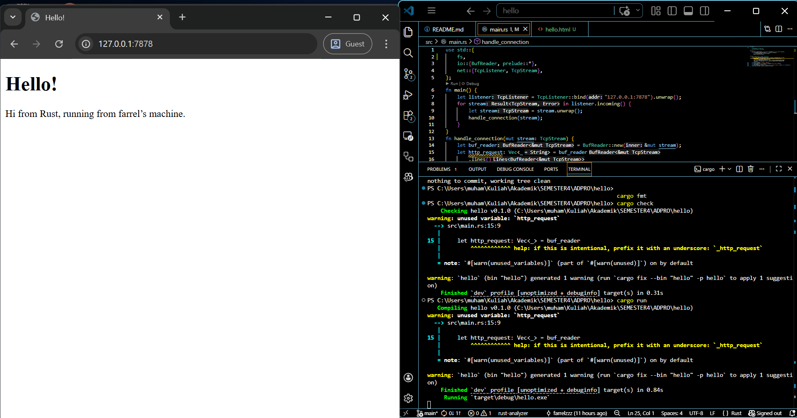

## Commit 1 Reflection Notes
Awalnya `TcpListener` di main menyiapkan port 7878 milik lokal sebagai server untuk menerima koneksi dari browser,
lalu `listener.incoming()` menghasilkan aliran data (`TcpStream`) setiap kali ada klien yang mencoba terhubung ke server tersebut. 

Setalah itu, aliran data (`TcpStream`) akan diproses oleh `handle_connection()` untuk membuat http request dalam bentuk `Vec` (list) dengan cara:  
* stream menntah dibungkus ke dalam buffer dengan `BufReader::new(&mut stream)`  
* stream dipecah jadi baris-baris teks dengan `lines()`  
* teks dari tiap baris di-mapping dan dipastikan tidak error dengan `map(|result| result.unwrap())`
* `take_while(|line| !line.is_empty())` membuat mapping berhenti jika sudah menemukan baris kosong. dengan kata lain, kita hanya mau ambil Header HTTP nya saja, tidak ambil Body HTTP.
* semua baris yang sudah di-mapping akan dikumpulkan ke `Vec` yang akan menjadi http request dengan `collect()`   
  
## Commit 2 Reflection Notes  
   
Setelah membaca request dari broweser,server membangun sebuah paket data yang mengikuti aturan protokol HTTP/1.1 yang memiliki 3 komponen utama ini:  
* Status line: `HTTP/1.1 200 OK` yang memberi tahu browser bahwa request berhasil diproses.  
* Header: berisi jumlah byte dari isi file `hello.html` yang dihitung dengan `contents.len()`, sehinggab browser tahu berapa data yang harus ia baca.  
* Body: isi dari file `hello.html` yag dibaca menggunakan `fs::read_to_string`.  

Ketiga komponen itu digabung jadi satu string dengan aturan pemisahan, yaitu Status Line dan Header dipisahkan oleh satu baris baru (`\r\n`) dan Header dengan Body dipisahkan oleh dua baris baru (`\r\n\r\n`). Lalu, paket data itu diubah jadi deretan byte yang akan dimasukkan ke dalam `TcpStream` (pakai `stream.write_all(response.as_bytes()).unwrap()`), sehingga paket data itu bisa dikirim sebagai response ke browser.