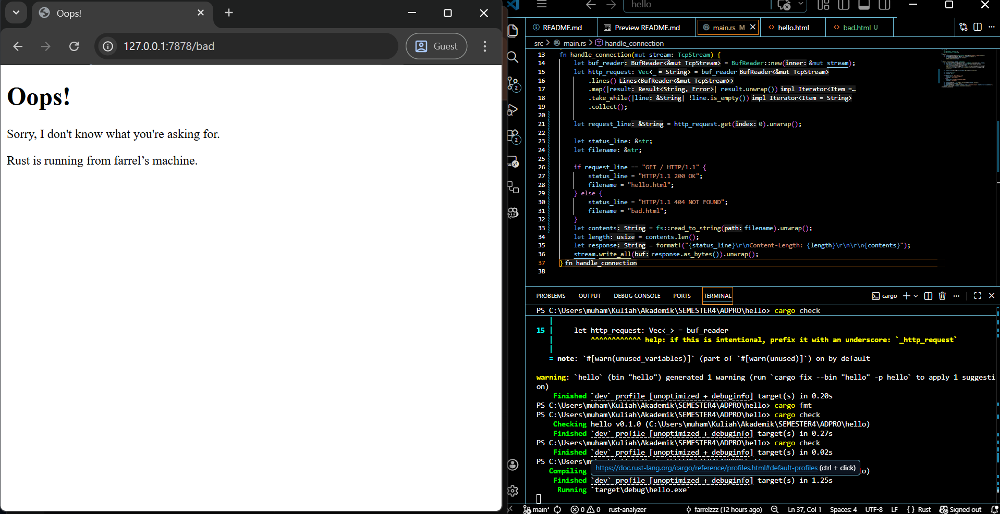

## Commit 1 Reflection Notes
Awalnya `TcpListener` di main menyiapkan port 7878 milik lokal sebagai server untuk menerima koneksi dari browser,
lalu `listener.incoming()` menghasilkan aliran data (`TcpStream`) setiap kali ada klien yang mencoba terhubung ke server tersebut. 

Setalah itu, aliran data (`TcpStream`) akan diproses oleh `handle_connection()` untuk membuat http request dalam bentuk `Vec` (list) dengan cara:  
* stream menntah dibungkus ke dalam buffer dengan `BufReader::new(&mut stream)`  
* stream dipecah jadi baris-baris teks dengan `lines()`  
* teks dari tiap baris di-mapping dan dipastikan tidak error dengan `map(|result| result.unwrap())`
* `take_while(|line| !line.is_empty())` membuat mapping berhenti jika sudah menemukan baris kosong. dengan kata lain, kita hanya mau ambil Header HTTP nya saja, tidak ambil Body HTTP.
* semua baris yang sudah di-mapping akan dikumpulkan ke `Vec` yang akan menjadi http request dengan `collect()`   
  
## Commit 2 Reflection Notes  
   
Setelah membaca request dari broweser,server membangun sebuah paket data yang mengikuti aturan protokol HTTP/1.1 yang memiliki 3 komponen utama ini:  
* Status line: `HTTP/1.1 200 OK` yang memberi tahu browser bahwa request berhasil diproses.  
* Header: berisi jumlah byte dari isi file `hello.html` yang dihitung dengan `contents.len()`, sehinggab browser tahu berapa data yang harus ia baca.  
* Body: isi dari file `hello.html` yag dibaca menggunakan `fs::read_to_string`.  

Ketiga komponen itu digabung jadi satu string dengan aturan pemisahan, yaitu Status Line dan Header dipisahkan oleh satu baris baru (`\r\n`) dan Header dengan Body dipisahkan oleh dua baris baru (`\r\n\r\n`). Lalu, paket data itu diubah jadi deretan byte yang akan dimasukkan ke dalam `TcpStream` (pakai `stream.write_all(response.as_bytes()).unwrap()`), sehingga paket data itu bisa dikirim sebagai response ke browser.  

## Commit 3 Reflection Notes  

Untuk kasus ini, pemisahan response untuk masing-masing request bisa kita lakukan dengan memanfaatkan `Vec` dari variabel `http_request` yang sebelumnya sudah kita miliki untuk mendapatkan HTTP Method milik request tersebut dengan mengambil elemen pertama `Vec` itu.  
Lalu, ambil nilai elemen pertama itu dengan (unwrap()) dan bandingkan dengan kondisional if-else. Jika HTTP Method nya `GET / HTTP/1.1`, kita kembalikan response dengan `HTTP/1.1 200 OK` sebagai status line dan `hello.html` sebgai HTML pesan sukse yang akan dirender.  
Jika HTTP Method-nya selain itu, kita kembalikan response dengan `HTTP/1.1 404 NOT FOUND` sebagai status line dan `bad.html` sebgai HTML pesan error yang akan dirender.  
Akhirnya kita berhasil memisahkan response sesuai dnegan request-nya.  

## Commit 4 Reflection Notes  
Seperti yang terlihat di `main`, for loop berisi `handle_connection()` akan menangani setiap percobaan terhubung ke server. Tapi saat `/sleep` mencoba terhubung, `thread::sleep(Duration::from_secs(10))` membuat thread yang sedang menjalankan kode ini berhenti selama 10 detik sebelum response dibuat. Lalu, kode ini masih menerapkan single-threading. Akibatnya, ketika memanggil `/sleep` sebelum `/`, keduanya akan sama-sama menunggu selama sepuluh detik sebelum keduanya berjalan. Hal itu terjadi karena thread yang mengeksekusi program hanya dan satu dan itupun harus menunggu 10 detik dahulu sebelum respons untuk masing-masing request dibuat. Maka dari itu, bisa disimpulkan bahwa kode ini akan berjalan sangat lambat jika ada banyak pengguna yang mengaksesnya, dan itu tidak bagus.    
  
## Commit 5 Reflection Notes  
Untuk mengatasi slow respons, kita bisa implementasikan multi-threading di kode ini menggunakan `ThreadPool` yang akan memisahkan tugas menerima koneksi dari tugas eksekusi kode. Thread utama hanya berfungsi sebagai penyalur tugas ke antrean (`channel`), sehingga ia bisa langsung menerima koneksi baru tanpa menunggu thread sebelumnya selesai. Lalu dengan bantuan `Arc` dan `Mutex`, antrean itu dapat diakses dengan aman oleh banyak thread pekerja (workers) dalam waktu yang sama.  
Setiap worker bisa berjalan independen di latar belakang, sehingga jika satu worker tertahan oleh request yang lambat seperti `/sleep`, akan ada worker lain yang bersedia memproses request baru dari antrean. Hal ini memungkinkan request lain seperi (`/`) bisa langsung dijalankan tanpa menunggu request sebelumnya yang kambat seperti (`/sleep`) selesai dijalankan.